<h1 align="center">Suburban Massage Website</h1>

[View the live project here.](https://smithylee81.github.io/MS1-SuburbanMassage/)

>A massage therapy website for customers to visit, explore their massage options and make contact to book their preferred 
treatment. The website is designed to be responsive and accessible on a wide range of devices, making it easy for everyone to access 
whether they're on the go or sitting at a desktop.

<h2 align="center">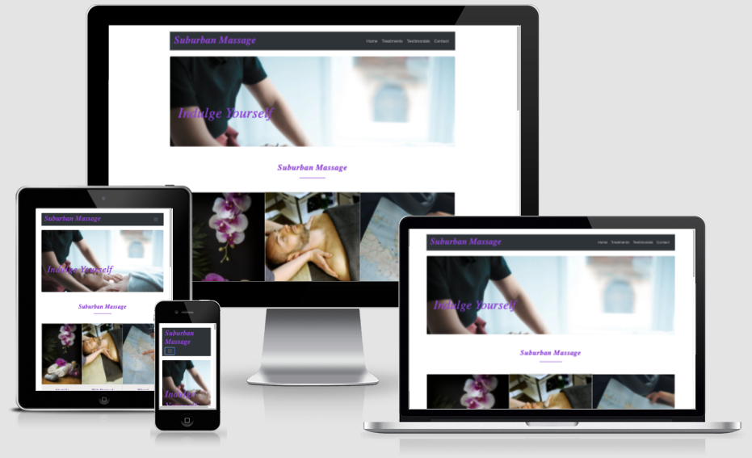</h2>

## User Experience (UX)
---

- ### User Stories

    - #### First Time Visitor Goals
        1. As a First Time Visitor, I want to easily understand the purpose of the site, what treatments are available and learn more about the massage therapist.
        2. As a First Time Visitor, I want to see positive feedback from previous clients and access social media information to build my confidence in the therapist to help make a decision on whether I choose this particular service or not.
        3. As a First Time Visitor, I want to clearly see what the costs of treatments are, which is also a determining factor in choosing any service.
        4. As a First Time Visitor, I also want to to be able to make effortless contact with the therapist should I choose to proceed, whether this is submitting an online enquiry or contacting via Facebook, Instagram or Twitter.

    - #### Returning Visitor Goals
        1. As a Returning Visitor, I want to be able to see if any new treatments are available and any special offers.  
        2. As a Returning Visitor, I want to be able to book a treatment again with ease and have consistency in the navigation of the site. 

    - #### Frequent User Goals
        1. As a Frequent User, I want to check if there are any special offers.
        2. As a Frequent User, I want to navigate again with ease and consistency to book my next treatment hassle free.

- ### Design

  - #### Colour Scheme
    - ##### A blend of natural earthy 'nurturing' colouring in conjunction with other nature orientated colours of purple/lilac blends to set a peaceful and tranquil scene for the user. 

  - #### Typography
    - ##### A bold but soft 'comforting feel' font was used to provide the user with a gentle experience in line with the overall purpose of the site in providing a relaxing and calming service. 

  - #### Imagery
    - ##### To coincide with the colour scheme and overall 'feel' of the site a relaxing image of someone having a massage is used for the main picture on the site with purple/lilac tones for that grounding and relaxation feel.

- ### UX Design Planes
    - #### Strategy
        - ##### My aim of the design is to make this a simple, stress free, ease of use website for individuals wishing to book for a massage treatment.

    - #### Scope
        - ##### For potential clients I want to provide them with a brief synopsis of my who I am, my background, qualifications, and experience. Providing an option for contact also should they wish to ask more about the treatments on offer.

    - #### Structure 
        - ##### I want the site to be intuitive, consistent, and easy to navigate. I aim to use separate 'cards' to highlight the benefits of massage, the treatments on offer and details about me all in any easy to see layout. I aim to keep it minimalistic so that it's easy on the eye and not weighed down with too much detail and loose a potential client’s interest.

    - #### Skeleton 
        - ##### Wireframes - [View](https://github.com/smithylee81/MS1-SuburbanMassage/commit/c81d4eb5b4067c19c9ff527003819b947fb2f464) Note basic drawings have been produced rather than on the Balsamiq website due to time constraints, this will be added should time allow. 

    - #### Surface
        - ##### The colour scheme together with the imagery described was used to create an overall pleasant, relaxing, easy on the eye experience. 
---
## Features

- ### Responsive on all devices

---
## Technologies Used
### Languages:

- ### HTML5
- ### CSS3
---
## Frameworks, Libraries & Programs Used / Resources

1. [Bootstrap 4.5:](https://getbootstrap.com/docs/4.5/getting-started/introduction/)
    - Bootstrap was be used to assist me with styling and responsiveness.
2. [Font Awesome:](https://fontawesome.com/)
    - Font Awesome was used to add icons for aesthetic and UX purposes.
3. [Git:](https://git-scm.com/)
    - Git was used for version control utilising the 'Gitpod Terminal' to 'Commit' and 'Push' to GitHub.   
4. [GitPod:](https://gitpod.io/workspaces/)
    - GitPod was be used as the main workspace for writing the code.
5. [GitHub:](https://github.com/)
    - GitHub was be used to store the code after being 'Pushed' from Gitpod.
6. [Google Fonts:](https://fonts.google.com/)
    - Google fonts were used to import the font styles into the sttyle.css file which is used on all pages throughout the site.  
7. [Unsplash:](https://unsplash.com/) 
    - Unsplash was used for the man having a massage image. 
8. [Pixabay:](https://pixabay.com/) 
    - Pixabay was used for the testimonials image and suburban massage image on home page. 
9. [Pexels:](https://www.pexels.com/) 
    - Pexels was used for the opening page image and map image. 
---

## Testing

- ### The W3C CSS Validator Service and HTML checker was used to validate the CSS page of the project to ensure there were no errors. 

-   [W3C Validator](https://validator.w3.org/nu/#textarea) - [Results](https://res.cloudinary.com/dodawjlab/image/upload/v1612554589/Screenshot_2021-02-05_at_18.08.20_txyjyp.png)
-   [W3C CSS Validator](https://jigsaw.w3.org/css-validator/validator) - [Results](https://res.cloudinary.com/dodawjlab/image/upload/v1612554430/Screenshot_2021-02-05_at_18.15.29_p4zrle.png)
- ### The Website was tested on Google Chrome, Firefox and Safari browsers.
- ### The website was viewed on a variety of devices such as Desktop, Laptop, various iPhones and iPads.
- ### Testing was done to ensure that the page links worked correctly.
- ### Friends and family members were also asked to review the site and documentation to point out any bugs and/or user experience issues.

## Testing User Stories from User Experience (UX) Section

- ### First Time Visitor Goals

    - #### As a first time visitor, I want to easily understand the main purpose of the site and learn more about the massage therapist, what treatments are available, testimonials to assess customer feedback, check out any social media accounts for other customer comments and know how to contact the therapist should I wish to pursue a massage.
        1. Upon entering the site, users are greated with an easily readable and clean title and navigation bar to allow access to the page of their choice. Below this there is an image of someone receiving a massage so the purpose of the site is clear.
        2. The user has two options, hover over and click the page links to each section or scroll down, both of which will lead them to the same areas. The hover effect works well assisting the user in seeing which section they are selecting.
        3. As a first time visitor, the user can select the Testimonials option and read feedback from customers/clients. 
        4. On the Contact Us page the user can complete the enquiry form and subit this using the clearly identifed 'Send my Enquiry' button, the user receives a confirmation via a new page stating 'Thanks!' with a link to return to the original site. 
        5. At the bottom of the page, the footer, the user has options to select Facebook, Instagram and Twitter to find out more about the massage service and these open in a new tab for ease of use and navigating in their browser.

- ### Returning Visitor Goals
    
    - #### As a returning visitor, I want to check if there are any new treatments available, see if there are any special offers and be able to send an enquiry with confidence.
        1. Upon re-entering the site the user has familiarity given the sites consistency and it's ease of use helps them navigate to the desired sections
        2. The user can 

- ### Frequent User Goals
    - #### As a frequent visitor, 
        1. 

## Further Testing 

- ### Manual Testing of each section
    - #### Home Page/Navigation Bar: All page links were tested to ensure they take the user to the desired area on the page, the dropdown menu was also tested on smaller devices to ensure the user still had these options on their mobile/smaller device. 

        1. Testing the navigation bar to ensure this takes the user to the different areas on the page:
    
    - #### Home Page, it was noted that this took the user to the 'Suburban Massage' title however the 'about us' and other info in this section was not visible requiring the user to scroll down slightly to find the info (see Known/Solved Bugs for further info on this):
    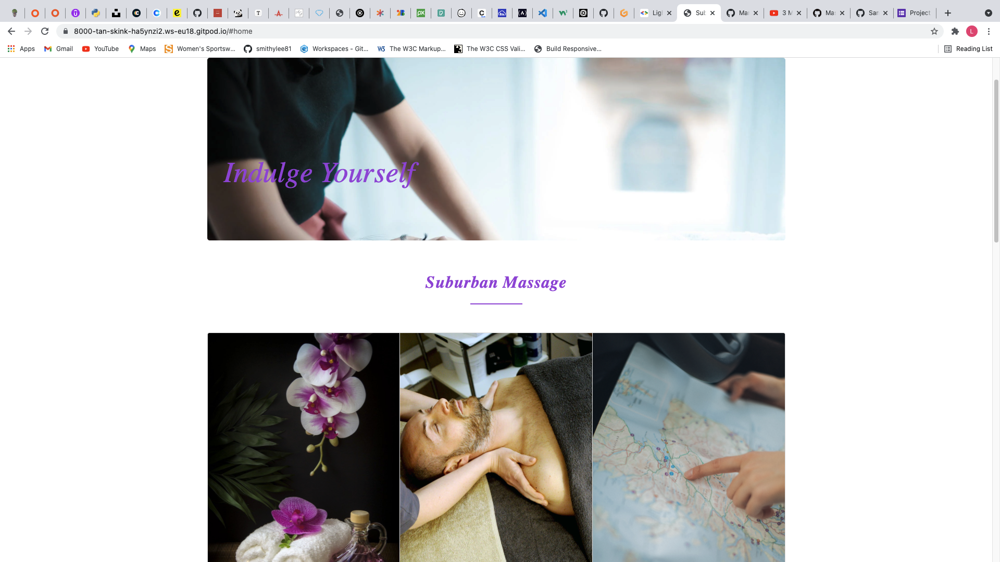
    - #### Dropdown Menu: 
    
    - #### Treatments Section:
    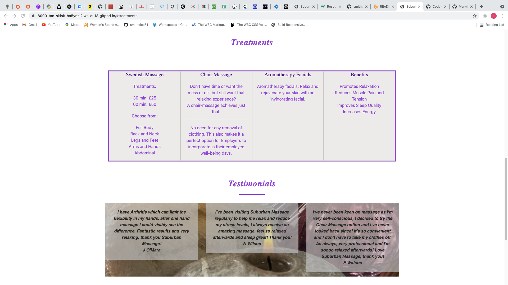
    - #### Testimonials Section: 
    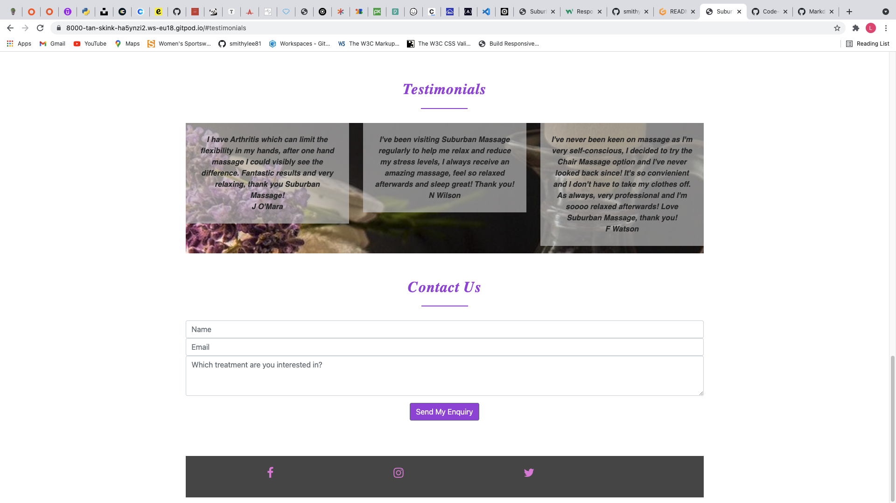
    - #### Contact Us Section: 
    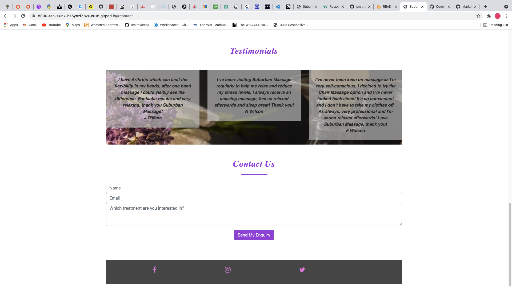 
    - #### Contact Us, form completion - mandatory details, should the user not enter their email adrress upon clicking the 'Send my Enquiry' button a warning message appears:
    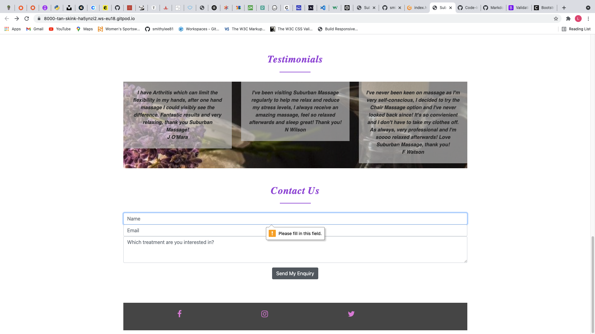 
    - #### Social Media Links, all icon links tested and open in a new tab: 
    Facebook
    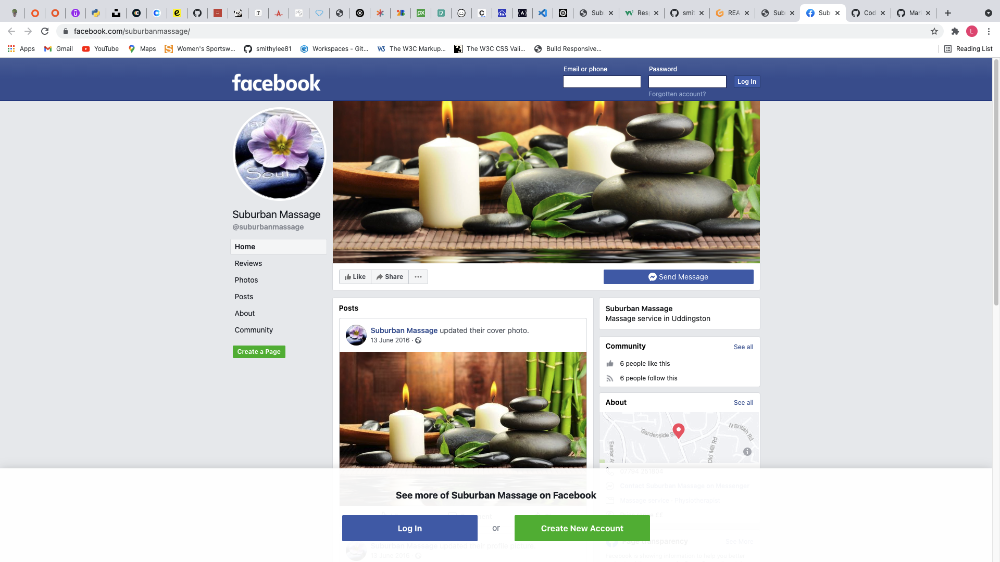
    Instagram 
    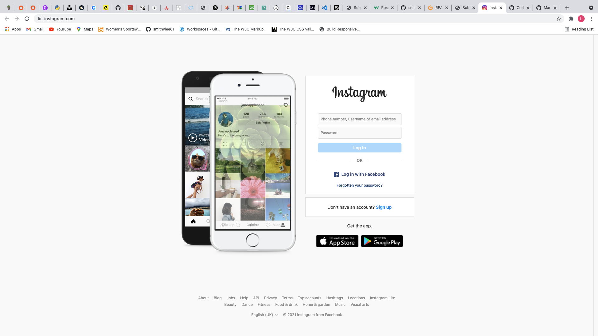
    Twitter
    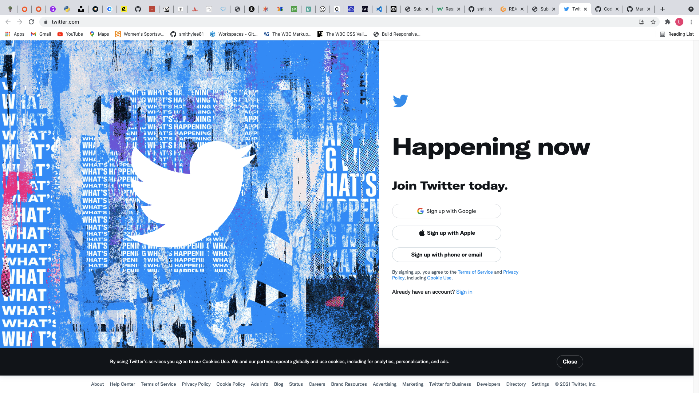

### Testing Site Responsiveness
- ####

### Known/Solved Bugs
- #### Upon selecting the home page link this takes the user to the 'Suburban Massage' heading below the main page picture (as demonstrated above in the further testing section)however the user has to scroll down a little to see the 'About Us' detail, the initial HTML showed that the 'id' tag "home" was attached to the opening page. To correct this an 'id' was added to the H3 heading 'Suburban Massage' as id="AboutUs" and the 'a class="nav-link" href changed to href"#AboutUs".
- #### Initial HTML   
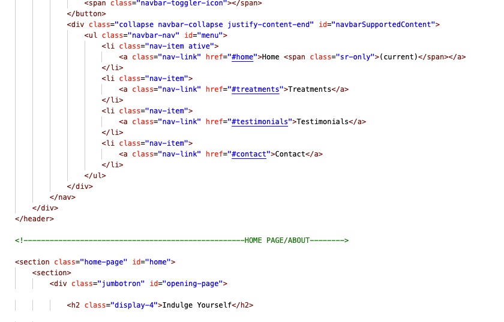

- #### Updated HTML
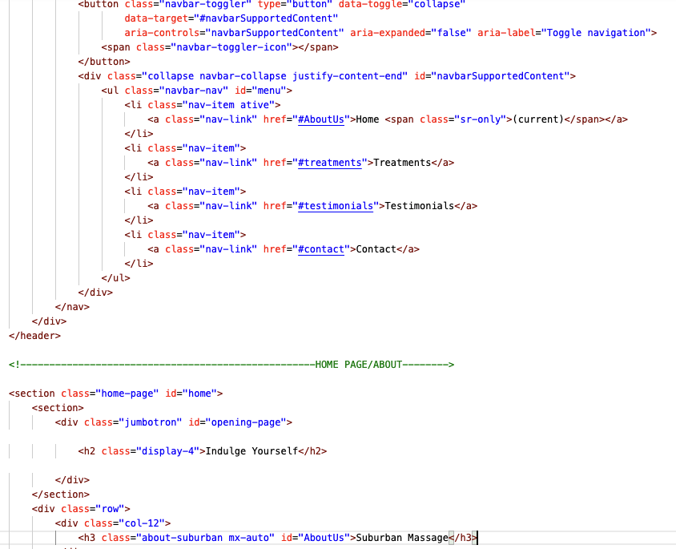

- #### User view following HTML changes
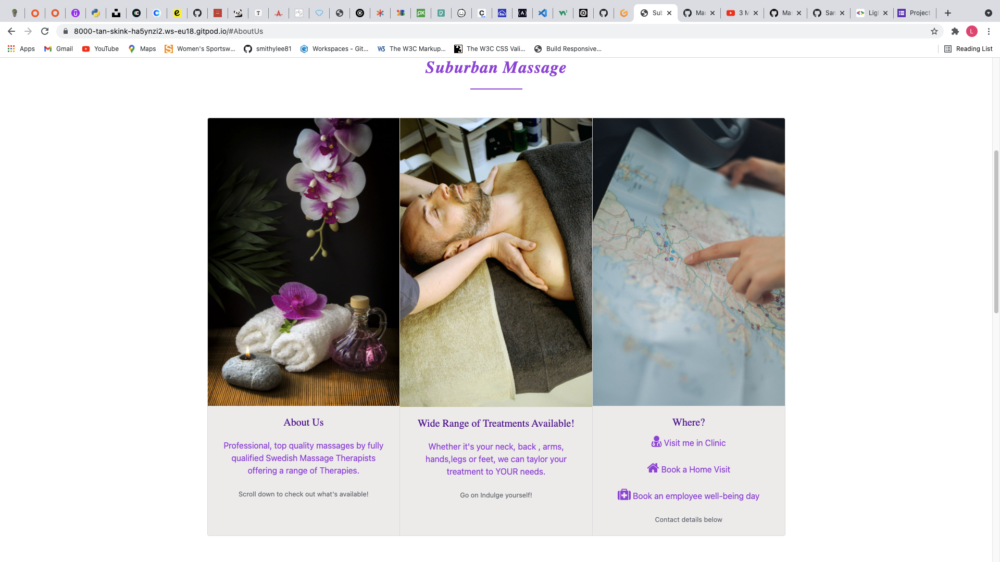

- #### After completing the fields in the 'Contact Us' section and clicking the 'Send My Enquiry' button the page changes to a different page with an error message stating 'Error response'. To correct this, following review of YouTube Video referenced below in 'Acknowledgements', a Form Action was added with the relevant email address and this was tested to activate this and provide a confirmation to the user that their form had been sent. 
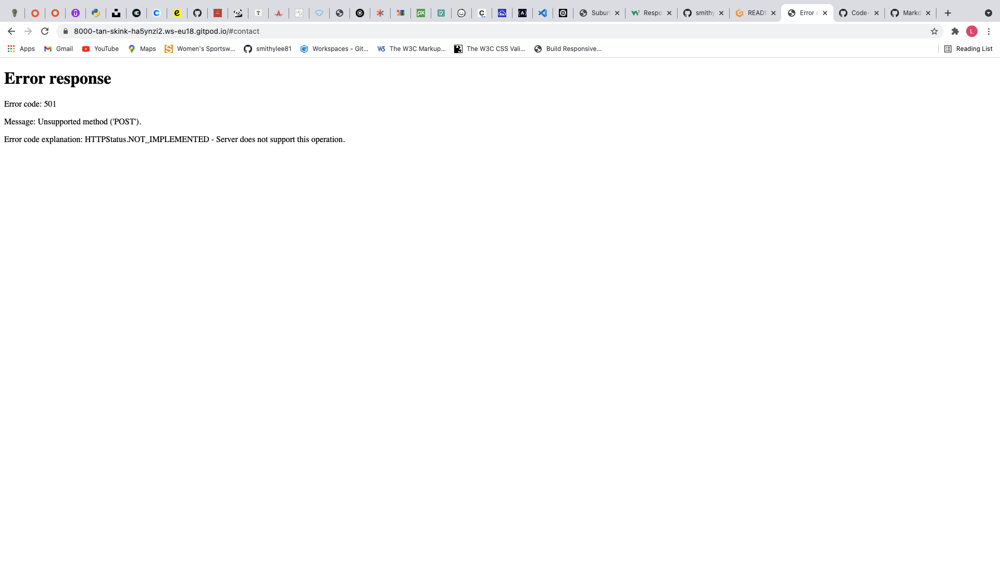

- #### Form Activation Message  
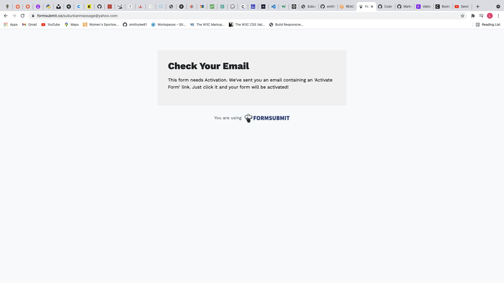

- #### Activation Email
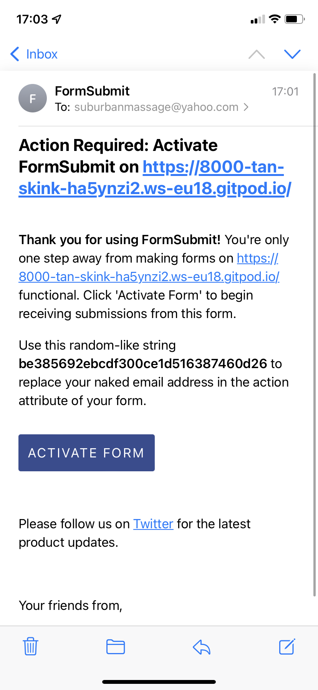

- #### Email Activated
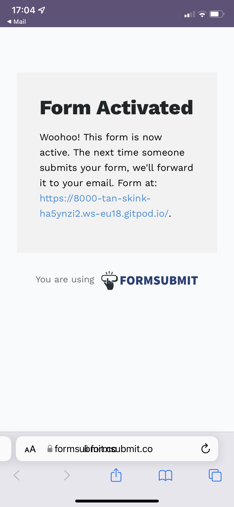

- #### Form Submission Suscess

- #### Email Receipt of Enquiry
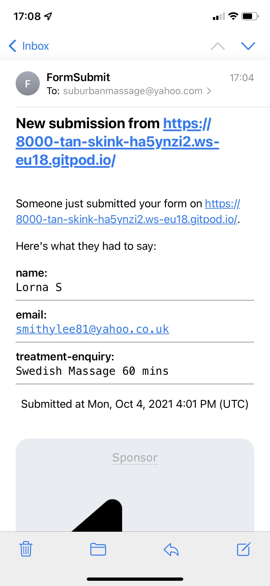
---

## Project Barriers & Solutions

- ### Difficulty with incorporating a massage mp4 video into the project, eventually used an image as was unable to solve. 
- ### Diffciulty with contact form as wanted to incorporate radio buttons to allow the user to select the type of massage they were interested in; eventually due to diffciulty with placement of this I opted for a standard text area on the form.
---

## Version Control

- ### Github and Gitpod used throughout for project using git commands to push to github repository.  

---

## Deployment
### GitHub Pages
 - The project was deployed to GitHub Pages using the following steps...

1. Log in to GitHub and locate the [GitHub Repository](https://github.com/)
2. At the top of the Repository (not top of page), locate the "Settings" Button on the menu.
3. Scroll down the Settings page until you locate the "GitHub Pages" Section.
4. Under "Source", click the dropdown called "None" and select "Master Branch".
5. The page will automatically refresh.
6. Scroll back down through the page to locate the now published site [https://smithylee81.github.io/MS1-SuburbanMassage/](https://github.com) in the "GitHub Pages" section.

### Making a Local Clone

1. Log in to GitHub and locate the GitHub Repository
2. Under the repository name, click "Clone or download".
3. To clone the repository using HTTPS, under "Clone with HTTPS", copy the link.
4. Open Git Bash
5. Change the current working directory to the location where you want the cloned directory to be made.
6. Type git clone, and then paste the URL you copied in Step 3.

---
## Credits

1. [Unsplash:](https://unsplash.com/) 
     - Unsplash was used for the man having a massage image. 
2. [Pixabay:](https://pixabay.com/) 
    - Pixabay was used for the testimonials image and suburban massage image on home page. 
3. [Pexels:](https://www.pexels.com/) 
    - Pexels was used for the opening page image and map image. 
4. [Bootstrap 4.5](https://getbootstrap.com/docs/4.5/getting-started/introduction/)
    - Bootstrap Library used throughout the project mainly to make site responsive using the Bootstrap Grid System, Containers and Cards.

---
## Acknowledgements
- ### My Mentor for continuous helpful feedback and guidance. 
- ### Code Institute Tutor Support for their advice and guidance.
- ### The slack community for peer support, encouragement, and tutorial you tube videos which were very helpful from Jim Lynx at CI "MS1 Planning Session" and "Workflow with Git, Gitpod and Github": 

- [YouTube Video MS1 Planning](https://youtu.be/sH0m9N875SU)
- [YouTube Video Workflow with Git, Gitpod and Github](https://youtu.be/6B0bHDDz1EM)
- [YouTube Video on Contact Form Submissions to Email Address](https://youtu.be/r4RQ38EoLds)

- ### Also, to Anna Greaves at CI for quick reference guides on the responsive grid: 
- [Bootstrap-grid-demo](https://ajgreaves.github.io/bootstrap-grid-demo/responsive.html)
---
